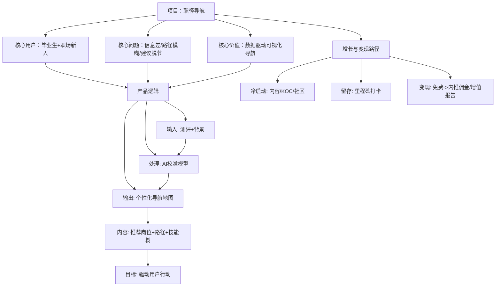

---

## **项目商业概要BP：职径导航**

### **1. 项目概述**
*   **项目名称**：职径导航（暂定）
*   **一句话定位**：一个为**中国大学生与职场新人**提供**数据驱动、个性化、可视化**高薪白领职业路径规划的AI导航平台。
*   **核心使命**：打破职业信息壁垒，帮助年轻人在卷曲的就业市场中，做出更明智、更具发展潜力的长期职业决策。
*   **产品形态**：初期以轻量级Web应用切入，支持快速测评与路径浏览。

### **2. 用户与市场洞察**
*   **核心用户**：
    *   **首要用户**：面临求职的**本科及以上学历应届毕业生**。核心诉求：找到一份有良好发展前景的“第一份工作”。
    *   **次要用戶**：工作**1-3年，对现状不满或寻求突破的职场新人**。核心诉求：评估转型可行性，找到薪资与发展空间更优的“下一步”。
*   **市场痛点**：
    1.  **信息过载且分散**：职业信息散落在招聘网站、社区、报告中，整合成本高。
    2.  **建议脱离市场**：传统职业测试（如MBTI）结果与本土高薪就业市场脱节。
    3.  **路径模糊不清**：只知道目标岗位，却不清楚如何从当前状态抵达，缺乏可执行的“地图”。
*   **市场机会**：在“就业难”与“招工难”并存的结构性矛盾下，提供精准供需匹配与技能导航的服务价值凸显。

### **3. 核心价值与产品逻辑**
*   **独特价值主张**：**“不只是告诉你适合什么，更告诉你如何到达，以及为什么这条路值得。”**
*   **产品核心逻辑**：
    1.  **输入**：用户完成MBTI等心理测试，并选择身份背景（毕业生/在职X年）。
    2.  **处理**：AI模型将测试结果与**多源本土数据库**（岗位要求、薪资数据、发展趋势）进行校准，过滤出“高薪白领”方向。
    3.  **输出**：生成 **“个性化职业导航地图”** ，包含：
        *   **推荐方向**：2-3个核心推荐岗位及理由（如：“需求增长快”）。
        *   **路径可视化**：针对每个岗位，展示从“当前状态”到“目标岗位”的里程碑序列。
        *   **关键信息**：对应技能树、典型薪资曲线、入门岗位示例。
*   **MVP功能聚焦**：
    *   互联网行业（技术、产品、运营、市场等）首批31个热门岗位的导航地图。
    *   基于公开数据与AI生成的初步报告。
    *   极简的Web界面，核心流程在5分钟内完成。

### **4. 商业模式与增长策略**
*   **初期策略（0-1阶段）：增长优先，信任建立**
    *   **变现**：完全免费，不做任何广告，以积累用户信任与规模为核心。
    *   **冷启动**：
        *   **内容引流**：制作“互联网高薪岗位路径图”等爆款图文/短视频，在知乎、小红书、B站传播。
        *   **博主合作**：邀请职场/教育类KOC进行体验推广。
        *   **社区渗透**：在相关豆瓣小组、校园论坛以“工具分享者”身份进行推广。
*   **中期演进（1-10阶段）：探索增值，精准变现**
    *   **留存机制**：引入 **“职业里程碑打卡”** 功能，增加用户回访与投入感。
    *   **商业化实验（择机启动）**：
        1.  **增值报告**：免费版提供概要，付费解锁详细技能缺口分析、学习资源清单、面试题库等。
        2.  **精准对接**：与招聘平台或企业合作，为明确求职意向的用户提供**简历优化**或**内推通道**服务，按成功入职收取佣金（**推荐首选**）。此模式与核心价值衔接紧密，变现路径自然。
        3.  **B端服务**：为高校就业指导中心或培训机构提供SAAS工具或数据服务。
*   **长期愿景**：成为中国年轻职场人职业发展的首选信任平台，构建从“认知-规划-学习-求职”的完整生态。

### **5. 后续执行建议**
*   **第一步（第1个月）：构建“样板间”**
    *   手动打造 **“产品经理”、“软件开发工程师”、“数字营销”** 3个岗位的精细化导航地图（作为内容与原型）。
    *   开发最简测评与结果展示Web页面。
*   **第二步（第2-3个月）：冷启动验证**
    *   用“样板间”内容进行社交媒体引流，获取首批1000名种子用户。
    *   收集用户对推荐结果和路径图的反馈，验证核心价值。
*   **第三步（第3-6个月）：数据迭代与模式验证**
    *   根据反馈迭代产品，并利用种子用户数据优化AI推荐模型。
    *   当单月访问用户稳定超过1万时，开始设计并上线第一个商业化实验（如内推通道）。
*   **关键风险与对策**：
    *   **数据权威性风险**：通过“多源标注”（如“数据来源：XX招聘平台2024年报”）和“UGC轻核实”机制增强可信度。
    *   **用户付费意愿风险**：坚持前期免费，后期仅对高价值、高确定性的对接服务收费，而非基本信息。

---

## **核心逻辑思维导图**

这份文档已为您将想法**结构化、战略化、可执行化**。您已拥有清晰的起点和路线图，可以即刻着手MVP的开发与冷启动运营。

**祝您启动顺利！**