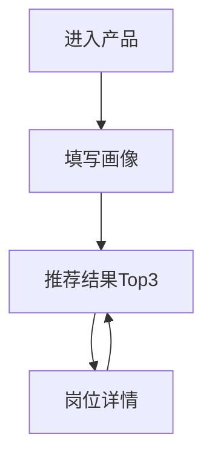

## PRD：职径导航（混合架构MVP）

### 0. 文档信息
- **产品名称**：职径导航（暂定）
- **文档类型**：PRD（MVP）
- **目标用户**：中国大学生（应届）与职场新人（1-3年）
- **范围版本**：MVP v1.1
- **更新时间**：2026-01-29
- **更新内容**：v1.1新增公司机会分析和分级薪资功能

---

## 1. 背景与目标

### 1.1 背景（来自BRD的关键结论）
- **痛点1：信息过载且分散**：岗位信息分散在招聘网站/社区/报告中，整合成本高。
- **痛点2：建议脱离市场**：传统测评与本土高薪就业市场脱节。
- **痛点3：路径模糊不清**：知道目标岗位，但不知道如何从当前状态抵达，缺少可执行“地图”。

### 1.2 MVP目标（要达成什么）
- **目标A（完成闭环）**：用户在 5 分钟内完成画像填写并拿到 Top3 推荐岗位。
- **目标B（可执行性）**：每个推荐岗位提供清晰“路径地图”：里程碑（3-5步）+关键技能+薪资区间（区间表达）+风险提示。
- **目标C（冷启动验证）**：验证“用户愿意看、愿意信、愿意转发”的内容与体验（用埋点数据判断）。

### 1.3 非目标（MVP不做什么）
- 不做付费、广告、简历服务、内推对接等商业化功能。
- 不做复杂的长期学习计划管理（例如周计划/提醒/打卡留存功能）。
- 不做多行业扩展（首期只做互联网行业31岗）。

---

## 2. 用户画像与核心场景

### 2.1 用户类型
- **U1：应届毕业生（本科及以上为主）**
  - 诉求：第一份工作方向更“值”，路径更清楚。
  - 典型输入：专业、实习经历（可无）、方向偏好、MBTI（可无）、学历层级。
- **U2：在职1-3年（寻求突破/转型）**
  - 诉求：评估转型可行性，找到“下一步”更优方向。
  - 典型输入：当前岗位/经历、方向偏好、兴趣标签、学历层级、MBTI（可无）。

### 2.2 核心场景（用户来做什么）
- **S1：我适合走哪条路？**（方向不清晰）
- **S2：我想去A岗位，怎么走？**（已有目标，想看路径地图）
- **S3：我能不能转？门槛在哪里？**（重点关心学历/经历门槛与现实提示）

---

## 3. MVP范围冻结（前置假设）

### 3.1 内容范围（固定）
- **互联网行业 31 个岗位**（覆盖：技术/产品/运营/数据/设计/市场/销售）
- 岗位库以**结构化模板**维护（见 `岗位库v1.md`），支持后续迭代替换与扩展。

### 3.2 核心闭环（固定）

### 3.3 画像字段（固定）
- **身份**：应届 / 在职1-3年（必填）
- **学历层级（四档）**（必填）
  - 985
  - 211（非985）
  - 双一流非985/211
  - 其他双非（含普通本科/民办/独立学院等在此档）
- **MBTI**：用户可直接选择 16 型（必填可选：允许“未知”）
  - 同时提供“站内简测”入口（可选）：用于不知道MBTI的用户快速获取一个参考类型（不追求严谨心理学结论，仅做体验引导）。
- **专业**（必填）
- **当前岗位/实习经历**（选填，但强烈建议填写）
- **方向偏好**（必填）：技术 / 产品 / 运营 / 数据 / 设计 / 市场 / 销售（单选）
- **兴趣标签**（必填，多选）：用于补充性偏好（列表见 5.2）

### 3.4 推荐方式（固定）
- **AI API（低成本优先）**：输出结构化推荐（Top3 + 理由摘要 + 风险提示 + 置信信号）。
- **Key与安全（固定）**：通过 **serverless proxy** 转发 + 限流；前端不直连、不内置Key。
- **预算口径（固定）**：按 **1,000次/月** 的“生成推荐结果”调用量进行预算与限流设计。

---

## 4. 信息架构与页面清单

### 4.1 页面列表（MVP）
- **P0 首页/引导页**：一句话价值主张 + 开始按钮 + 说明（不会保存隐私数据/仅用于生成推荐）。
- **P1 画像收集页**：身份/学历/专业/经历/方向偏好/兴趣标签/MBTI选择（含简测入口）。
- **P2 推荐结果页**：Top3岗位卡片 + 推荐理由摘要 + 置信/风险提示 + 进入详情按钮。
- **P3 岗位详情页**：路径里程碑（3-5步）+技能清单+薪资区间+入门岗位示例+现实门槛提示+学习资源占位。

### 4.2 关键导航与返回策略
- 推荐结果页支持切换 Top3 并进入详情；详情页返回结果页保持选中状态。
- 画像收集页支持“返回修改”，修改后重新生成推荐。

---

## 5. 页面需求（逐页说明）

### 5.1 P0 首页/引导页
- **目标**：让用户理解“这是什么”并愿意开始。
- **主要元素**
  - 标题：职径导航
  - 副标题：5分钟生成你的互联网职业路径地图
  - CTA：开始测评/开始规划
  - 免责声明/隐私提示：不收集实名信息；推荐仅供参考
- **验收点**
  - 点击 CTA 进入 P1

### 5.2 P1 画像收集页
- **目标**：用尽可能少的字段拿到可用推荐。
- **字段与交互**
  - 身份（必填）：单选
  - 学历层级（必填）：四档单选（见3.3）
  - 专业（必填）：下拉（可搜索）或自由输入 + 推荐常见专业
  - 当前岗位/实习经历（选填）：自由输入（例：前端实习/学生会运营/无）
  - 方向偏好（必填）：单选（技术/产品/运营/数据/设计/市场/销售）
  - 兴趣标签（必填，多选，建议最多选5个）
    - 例：写代码、做产品规划、与人沟通、做数据分析、做创意设计、做内容、做增长、做商务谈判、做客户关系、做项目推进、喜欢稳定、喜欢挑战
  - MBTI（可选“未知”）：16型选择器
  - MBTI简测入口（可选）：弹窗/独立页（10-20题），输出一个参考类型并允许用户确认/修改
- **提交按钮**
  - 文案：生成我的推荐
  - 提交后进入加载态（调用AI）
- **异常/兜底**
  - AI超时/失败：提示“生成失败，已为你提供基础推荐（非AI）”，回退到规则模板推荐（见 7.4）。

### 5.3 P2 推荐结果页
- **目标**：清晰展示 Top3 + 让用户进入详情验证“路径可执行”。
- **每个岗位卡片包含**
  - 岗位名称 + 一句话定位
  - 推荐理由（3条内，每条<=20字）
  - 风险提示（可选，<=1条）
  - CTA：查看路径地图
- **页面级元素**
  - “返回修改画像”
  - “重新生成”（有冷却/限流提示）
- **验收点**
  - Top3 必须可点击进入 P3
  - 返回修改后可重新生成推荐

### 5.4 P3 岗位详情页
- **目标**：让用户"看完就知道下一步做什么"，并理解门槛差异（尤其学历）。
- **内容区块（顺序建议）**
  - 岗位概览：一句话 + 适合谁（结合画像）
  - 现实门槛提示：学历/经历对该岗位的影响（用"提示语"表达，不做歧视性表述）
  - 路径里程碑（3-5步）：从当前状态到目标岗位的阶段（每步包含：阶段名/时间建议/关键产出）
  - 关键技能（分组）：硬技能/软技能/作品集或项目要求
  - **公司机会分析**（新增）：根据用户学历判断进入大厂/中厂/小厂的机会，展示北上广深四个城市的互联网大厂和中厂列表
  - **分级薪资参考**（新增）：将薪资按照大厂/中厂/小厂三个等级进行划分展示（入门/1-3年/3-5年），每个等级显示对应薪资区间
  - 入门岗位示例：助理/实习/初级岗位名称
  - 学习资源占位：可后续补充链接
- **验收点**
  - 路径至少3步，且每步至少1条可执行动作（例如"完成一个XX项目并写成作品集"）
  - 公司机会区块正确显示用户学历对应的机会等级（高/中/低）
  - 分级薪资区块正确展示大厂/中厂/小厂三个等级的薪资区间

---

## 6. 数据与字段定义（前端可实现）

### 6.1 UserProfile（用户画像）
| 字段 | 类型 | 必填 | 示例 | 说明 |
|---|---|---:|---|---|
| identity | string | 是 | graduate / junior | 应届/在职1-3年 |
| educationTier | string | 是 | 985 / 211 / doubleFirstClass / other | 学历四档 |
| major | string | 是 | 计算机科学与技术 | 专业 |
| currentExperience | string | 否 | 前端实习3个月 | 当前岗位/实习/经历概述 |
| trackPreference | string | 是 | eng / pm / ops / data / design / marketing / sales | 方向偏好（单选） |
| interestTags | string[] | 是 | [\"写代码\",\"做数据分析\"] | 兴趣标签（多选） |
| mbti | string | 否 | INTJ / unknown | 用户选择或未知 |
| mbtiFromMiniTest | boolean | 否 | true/false | 是否来自简测（用于体验分析） |

### 6.2 Job（岗位库条目）
> 岗位库是“可解释推荐”的基础：AI不应凭空编造岗位世界观，应基于岗位库进行“筛选+表达”。\n\n+| 字段 | 类型 | 示例 | 说明 |
|---|---|---|---|
| jobId | string | eng_frontend | 唯一ID |
| jobName | string | 前端工程师 | 岗位名 |
| category | string | eng | 大类（7类之一） |
| oneLiner | string | 用代码把产品体验做出来 | 一句话定位 |
| suitableTracks | string[] | [\"eng\"] | 适合方向（用于规则兜底） |
| coreSkills | string[] | [\"HTML/CSS\",\"JavaScript\"] | 核心技能（概览级） |
| milestones | object[] | ... | 路径里程碑（见 CareerMap） |
| salaryBands | object | ... | 薪资区间（区间表达，作为基准薪资） |
| entryRoles | string[] | [\"前端实习生\",\"初级前端\"] | 入门岗位示例 |
| educationNotes | object | ... | 学历层级影响提示（分档文案） |

### 6.3 CareerMap（路径地图，嵌入到Job或独立）
| 字段 | 类型 | 示例 | 说明 |
|---|---|---|---|
| steps | object[] | [{name, duration, outputs, skills}] | 3-5步 |
| risks | string[] | [\"对作品集质量要求高\"] | 风险提示（简短） |
| resourcesPlaceholder | string[] | [\"待补：课程/书单/社区\"] | 学习资源占位 |

### 6.4 Recommendation（推荐结果，AI输出结构）
| 字段 | 类型 | 必填 | 示例 | 说明 |
|---|---|---:|---|---|
| topJobs | object[] | 是 | [{jobId, fitScore, reasons, riskHint}] | Top3列表 |
| summary | string | 是 | 你更适合... | 结果页顶部摘要（短） |
| confidence | string | 否 | low/medium/high | 置信信号（用于提示） |
| nextAction | string | 否 | 先看A岗位详情... | 下一步建议（短） |

### 6.5 Company（公司数据）
> 用于展示北上广深四个城市的互联网公司列表，支持公司机会分析功能。

| 字段 | 类型 | 示例 | 说明 |
|---|---|---|---|
| city | string | beijing / shanghai / guangzhou / shenzhen | 城市代码 |
| big | string[] | [\"百度\",\"字节跳动\",\"美团\",...] | 大厂列表 |
| medium | string[] | [\"小红书\",\"B站\",\"快手\",...] | 中厂列表 |

**公司等级定义**：
- **大厂**：BAT（百度、阿里、腾讯）、字节跳动、美团、滴滴、京东、网易、小米、华为等头部互联网公司
- **中厂**：小红书、B站、快手、拼多多、携程、知乎、陌陌、360、搜狗等知名独角兽或B轮以上公司

### 6.6 CompanyOpportunity（公司机会判断）
> 根据用户学历判断进入不同等级公司的机会。

| 字段 | 类型 | 示例 | 说明 |
|---|---|---|---|
| educationTier | string | 985 / 211 / doubleFirstClass / other | 学历层级 |
| bigCompany | string | high / medium / low | 大厂机会等级 |
| mediumCompany | string | high / medium / low | 中厂机会等级 |
| smallCompany | string | high / medium / low | 小厂机会等级 |

**机会等级规则**：
- **985**：大厂机会高、中厂机会高、小厂机会高
- **211**：大厂机会中、中厂机会高、小厂机会高
- **双一流**：大厂机会低、中厂机会中、小厂机会高
- **其他**：大厂机会低、中厂机会低、小厂机会中

### 6.7 TieredSalary（分级薪资）
> 将基准薪资按照公司等级进行分级计算。

| 字段 | 类型 | 示例 | 说明 |
|---|---|---|---|
| big | object | {entry: \"10-20K\", junior: \"20-33K\", mid: \"33-52K\"} | 大厂薪资（基准×1.3） |
| medium | object | {entry: \"8-15K\", junior: \"15-25K\", mid: \"25-40K\"} | 中厂薪资（基准×1.0） |
| small | object | {entry: \"6-12K\", junior: \"12-20K\", mid: \"20-32K\"} | 小厂薪资（基准×0.8） |

**薪资计算规则**：
- 大厂薪资 = 基准薪资 × 1.3（高30%）
- 中厂薪资 = 基准薪资 × 1.0（基准）
- 小厂薪资 = 基准薪资 × 0.8（低20%）

---

## 7. 推荐与AI设计（低成本优先）

### 7.1 推荐策略（总体）
- **先基于岗位库候选集**：按方向偏好（trackPreference）+兴趣标签粗筛出候选岗位（例如 8-12个）。
- **再由AI在候选里选Top3并生成表达**：理由/风险/下一步建议（结构化JSON）。
- **必须可回退**：AI失败时用规则模板生成Top3，保证闭环不断。

### 7.2 输出约束（控成本/可解析）
- **强制JSON输出**：字段固定，便于前端直接渲染。
- **限制字数**：\n  - `summary` <= 80字\n  - 每个岗位 `reasons` <= 3条，每条 <= 20字\n  - `riskHint` <= 20字\n- **不允许编造数据来源**：薪资/门槛等敏感信息只允许使用“区间表达+提示语”，不输出具体平台引用（除非后续补齐来源）。

### 7.3 Prompt骨架（产品侧要求）
- 输入：`UserProfile` + 候选岗位的结构化摘要（jobName/oneLiner/coreSkills/milestones简述/educationNotes摘要）。
- 输出：严格JSON（见6.4）。

### 7.4 失败兜底（无AI/超时）
- 规则模板：\n  - 以 `trackPreference` 为主轴挑选 2 个同类岗位 + 1 个相邻岗位（例如产品→增长/运营）。\n  - 理由使用固定文案模板（由岗位库的 `oneLiner` + `coreSkills` 组合而成）。\n- UI提示：\n  - “当前为基础推荐（非AI生成），你可稍后重试获得更个性化版本。”\n
---

## 8. Serverless Proxy（产品侧要求）

### 8.1 目标
- **Key不下发前端**，避免泄露。
- **可控成本**：按 1,000次/月 口径可设硬上限，超限后降级。
- **基础防刷**：避免被脚本批量调用。

### 8.2 限流建议（写入验收/实现要求）
- **月度上限**：1,000次/月（达到上限后返回“今日额度已用完/请明日再试”或直接走规则兜底）。
- **日限流**：建议 50次/天（可配置）。
- **单用户/单IP**：建议 5次/天（可配置）。
- **冷却时间**：同一会话“重新生成”按钮 30-60秒冷却（前端提示）。

### 8.3 缓存策略（控成本）
- **同画像缓存**：对 `UserProfile` 做归一化后hash作为key，缓存推荐结果（TTL建议7天）。
- **相近画像缓存（可选）**：只按（身份+学历+方向偏好+MBTI）生成粗粒度key，提高命中率（但个性化下降）。

---

## 9. 埋点与指标（MVP）

### 9.1 漏斗指标（核心）
- `pv_entry`（进入产品）
- `click_start`（点击开始）
- `submit_profile`（提交画像）
- `ai_success` / `ai_fail`（AI成功/失败）
- `view_result`（看到推荐结果）
- `click_job_detail`（进入岗位详情）

### 9.2 内容质量指标（辅助）
- `detail_stay_time`（详情停留时长）
- `switch_top_job`（在Top3之间切换次数）
- `back_to_profile_edit`（返回修改画像）

### 9.3 关键成功阈值（建议写法）
- 画像提交完成率（submit_profile / click_start）≥ 50%
- 进入详情率（click_job_detail / view_result）≥ 60%
- AI失败率（ai_fail / submit_profile）≤ 10%（否则需要优化proxy或兜底体验）

---

## 10. 验收标准（可测试）

### 10.1 功能验收
- 用户可完成：P0 → P1 → P2 → P3 全流程，不出现阻断。
- P1 必填项缺失时有明确提示，不能提交。
- P2 必须展示Top3，且每个岗位至少有1条推荐理由。
- P3 必须包含：里程碑（≥3步）、技能清单、薪资区间、学历提示语、公司机会分析、分级薪资参考。
- P3 公司机会区块正确显示用户学历对应的机会等级，并展示北上广深四个城市的大厂和中厂列表。
- P3 分级薪资区块正确展示大厂/中厂/小厂三个等级的薪资区间（入门/1-3年/3-5年）。

### 10.2 异常与降级验收
- AI超时/失败时：\n  - P2仍可展示“基础推荐”（规则兜底），并明确提示。\n  - 不出现空白页/死循环加载。\n- 达到限流/额度上限时：\n  - 明确提示（今日/本月额度），并自动切到规则兜底推荐。\n

### 10.3 数据与解析验收
- AI返回必须是可解析JSON；解析失败视为失败并触发兜底。
- 关键埋点在对应操作触发一次且仅一次（避免重复上报）。

---

## 11. 风险与对策（MVP）
- **Key安全风险**：前端不直连；必须走proxy；限流+缓存；设置月度上限。
- **成本失控风险**：低成本输出约束 + 缓存 + 降级兜底 + 冷却时间。
- **内容权威性风险**：薪资/门槛用区间表达+"仅供参考"；后续补充数据来源字段。
- **表单过长风险**：字段尽量少；兴趣标签最多选5；MBTI允许"未知"。

---

## 12. 新增功能：公司机会分析与分级薪资（v1.1）

### 12.1 功能概述
在P3岗位详情页新增两个功能模块，帮助用户更好地理解不同公司等级的机会和薪资差异：
1. **公司机会分析**：根据用户学历判断进入大厂/中厂/小厂的机会等级，并展示北上广深四个城市的互联网公司列表
2. **分级薪资参考**：将岗位薪资按照大厂/中厂/小厂三个等级进行划分展示

### 12.2 公司等级定义
- **大厂**：BAT（百度、阿里、腾讯）、字节跳动、美团、滴滴、京东、网易、小米、华为等头部互联网公司
- **中厂**：小红书、B站、快手、拼多多、携程、知乎、陌陌、360、搜狗等知名独角兽或B轮以上公司
- **小厂**：其他互联网公司

### 12.3 学历机会判断规则
根据用户学历层级（985/211/双一流/其他）判断进入不同等级公司的机会：
- **985**：大厂机会高、中厂机会高、小厂机会高
- **211**：大厂机会中、中厂机会高、小厂机会高
- **双一流**：大厂机会低、中厂机会中、小厂机会高
- **其他**：大厂机会低、中厂机会低、小厂机会中

### 12.4 薪资分级计算规则
基于岗位的基准薪资（salaryBands），按照公司等级进行分级计算：
- **大厂薪资** = 基准薪资 × 1.3（高30%）
- **中厂薪资** = 基准薪资 × 1.0（基准）
- **小厂薪资** = 基准薪资 × 0.8（低20%）

薪资分级适用于三个经验阶段：入门级（0-1年）、初中级（1-3年）、中高级（3-5年）。

### 12.5 数据要求
- **公司数据文件**：`src/data/companies-data.js`
  - 包含北上广深四个城市的互联网大厂和中厂列表
  - 按城市分类组织数据
  - 支持前端直接引用
- **数据更新**：公司列表可根据市场变化定期更新，保持信息的时效性

### 12.6 展示要求
- **公司机会区块**：
  - 显示用户学历对应的机会等级（高/中/低），使用清晰的视觉提示（颜色/图标）
  - 展示北上广深四个城市的大厂和中厂列表
  - 提供针对性的建议文案
- **分级薪资区块**：
  - 使用卡片或表格形式展示大厂/中厂/小厂三个等级的薪资
  - 每个等级显示入门级/初中级/中高级三个阶段的薪资
  - 添加说明文字："薪资因公司规模而异，仅供参考"

### 12.7 注意事项
- 公司列表和薪资分级仅供参考，不构成就业建议
- 实际薪资和机会受多种因素影响（个人能力、面试表现、市场环境等）
- 保持内容的中性和客观性，避免歧视性表述

